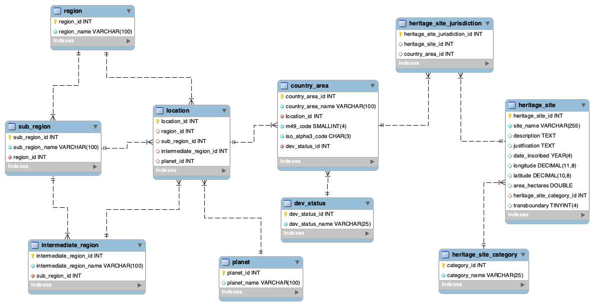

## Heritage Site App
The heritagesites app is used to explore both the Django web framework and a MySQL database composed of UNESCO heritage sites linked to UNSD country, area and region codes.

data model:

